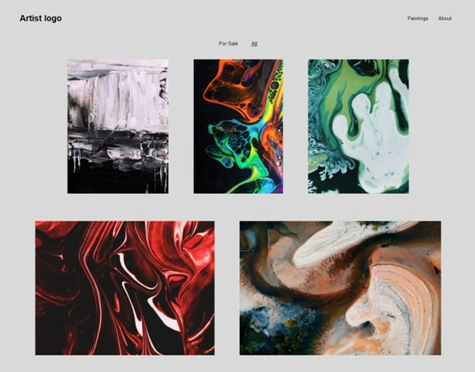
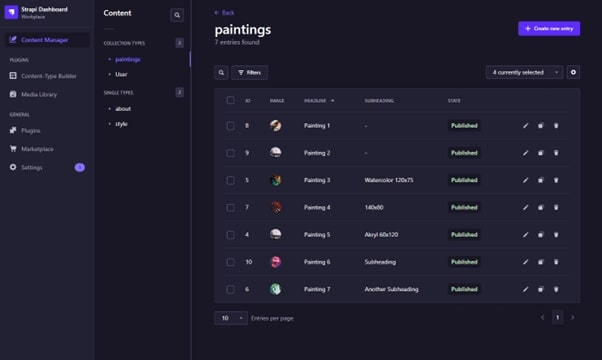

# Website with headless CMS

This is a full-stack application for an artist's website. The user can easily manage content and styling of the website through an Admin panel.

The front end is built with Svelte and the back end uses Strapi headless CMS, which is built on express and a React admin panel.
Through the CMS, colors, paintings and text content can be changed. The backend is hosted on Heroku with a MySQL database and media content is stored with Cloudinary. The website is proxied through Cloudflare to provide easy caching and DDoS protection.

